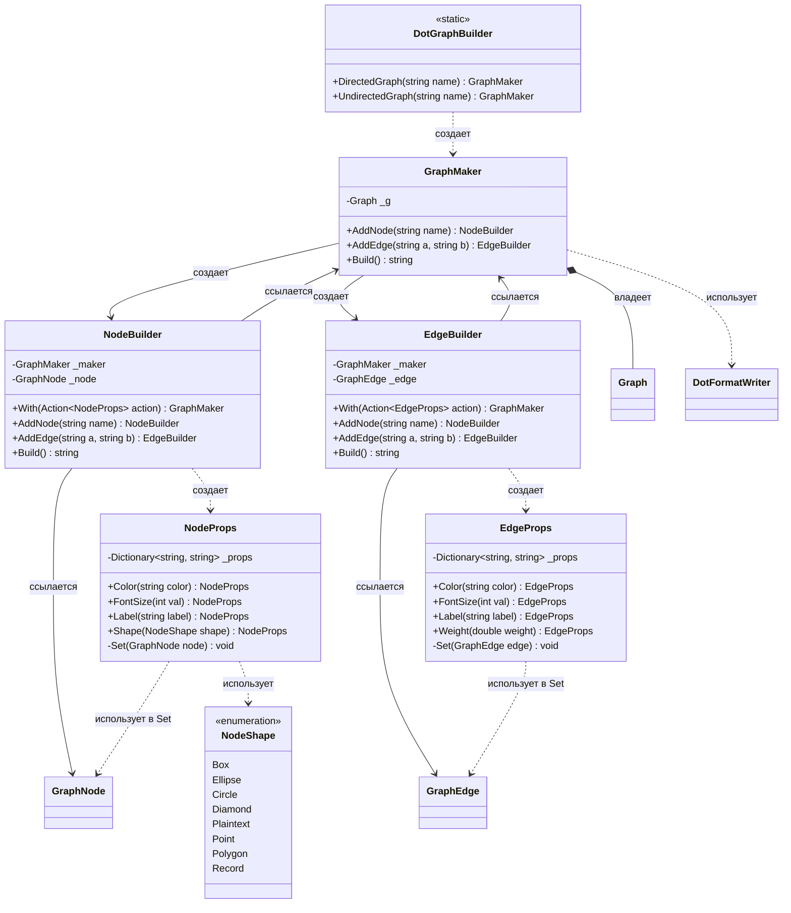

# Практика: GraphViz

## 1. Описание предметной области и сущностей
Статический класс DotGraphBuilder служит точкой входа и создаёт GraphMaker, который хранит граф (Graph) и отвечает за добавление узлов и рёбер,
возвращая NodeBuilder и EdgeBuilder соответственно.
Эти билдеры хранят ссылки на GraphMaker и на конкретный GraphNode или GraphEdge, 
позволяют через метод With настроить атрибуты с помощью NodeProps или EdgeProps
(каждый из которых содержит словарь свойств и метод Set для их применения)
и вернуть управление обратно в GraphMaker для продолжения цепочки;
в конце вызов Build() генерирует итоговую DOT-строку через DotFormatWriter.
Разделение NodeProps (color, fontsize, label, shape) и EdgeProps 

## 2. Диаграмма классов (Mermaid)

