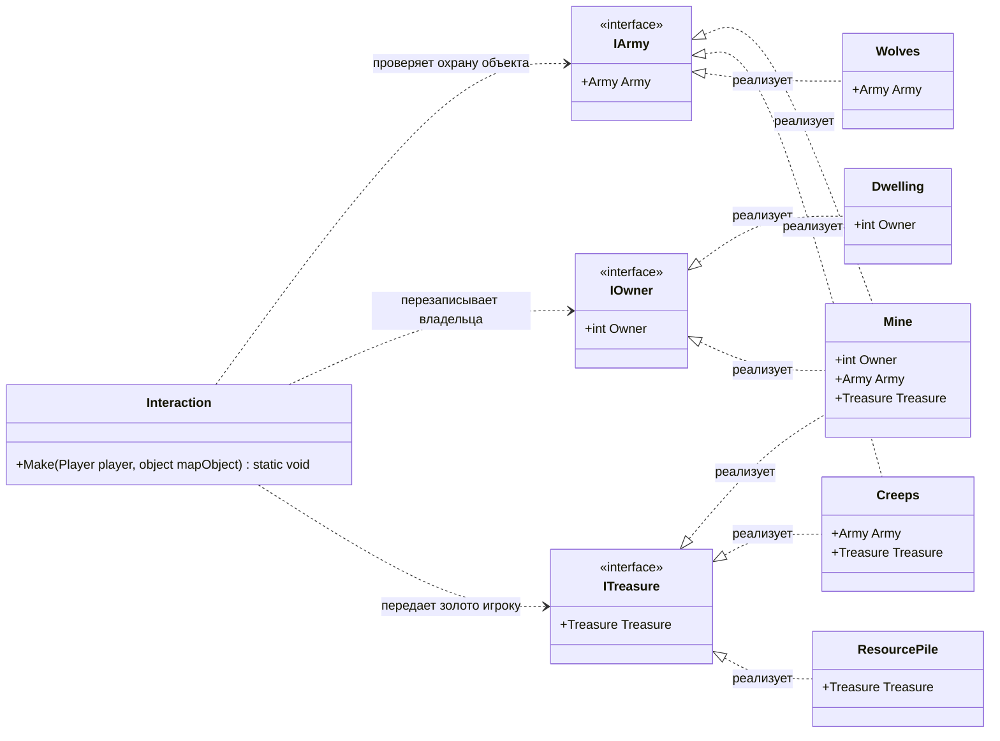

## Практика 2. HoMM
P.S поменял тип связей на диаграмме, и добавил базовый интерфейс IMapObject от которого наследуются все остальные интерфейсы и соответственно он передается в метод Interaction.Make

### 1. Описание предметной области:

- IMapObject (Объект карты): базовый интерфейс-маркер, являющийся корневой абстракцией для всех сущностей на карте.
- Боевой объект (IArmy): Содержит вражескую армию (Army). Обязывает принять бой. При проигрыше наступает смерть персонажа.
- Захватываемый объект (IOwner): Имеет владельца (Owner). После посещения переходит под контроль игрока.
- Источник сокровищ (ITreasure): Хранит ценности (Treasure), которые передаются игроку.
- Модуль взаимодействия (Interaction): Принимает игрока и абстрактный IMapObject и поочередно проверяет объект на три роли (Бой -> Захват -> Награда).
- Классы: Dwelling, Mine, Creeps, Wolves, ResourcePile реализуют интерфейсы IArmy, IOwner и ITreasure согласно заданию, подробнее на диаграмме.

### 2. Диаграмма классов:

