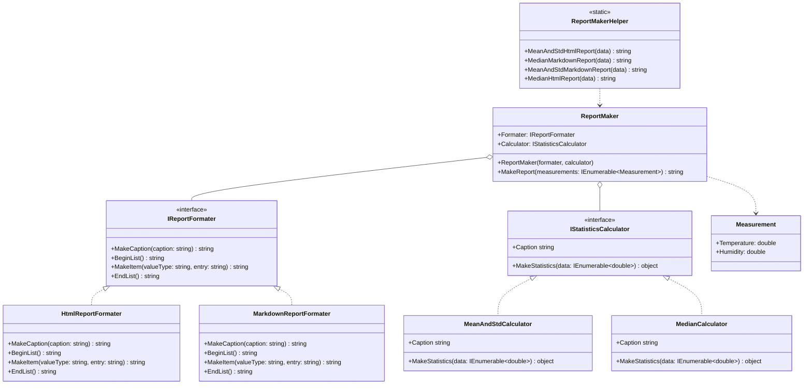

# Практика: Генератор Отчётов

## 1. Описание предметной области и сущностей
- IReportFormater : интерфейс для оформления отчёта. Говорит классам что нужно уметь делать для оформления
- HtmlReportFormater / MarkdownReportFormater : конкретные реализации интерфейса форматирования. Один умеет оборачивать текст в HTML теги, другой в Markdown символы.
- IStatisticsCalculator : интерфейс для подсчёта статистики. Говорит классам что нужно уметь считать по набору чисел и иметь название Caption.
- MeanAndStdCalculator / MedianCalculator : конкретные реализации подсчёта. Один считает среднее и стандартное отклонение, другой медиану.
- ReportMaker : главный класс который собирает отчёт. Получает форматтер и калькулятор в конструктор и просто просит каждого сделать свою работу.
- ReportMakerHelper : вспомогательный класс для удобного вызова снаружи. Собирает нужные комбинации форматтера и калькулятора и передаёт их в ReportMaker. Именно тут видно главное преимущество рефакторинга : новую комбинацию форматта и статистики можно добавить одной строкой.
- Measurement : простая модель с двумя полями Temperature и Humidity. Передаётся в MakeReport как входные данные.

## 2. Диаграмма классов (Mermaid)

