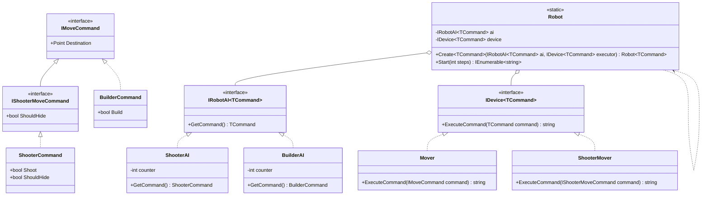

# Практика 4: Роботы

## 1. Описание предметной области и сущностей

- **Интерфейс IRobotAI**: представляет собой интеллектуальную систему робота, зона ответственности которой — генерация команд управления. За счет применения ковариации (out), система позволяет подставлять ИИ, возвращающий более специфичные команды, туда, где ожидаются базовые.
-  **Интерфейс IDevice**: описывает исполнительное устройство (модуль движения, боевой модуль), которое принимает команды на вход и выполняет их. Использование контравариации (in) гарантирует, что устройство, способное обрабатывать базовые команды, может безопасно принимать и их наследников.
-  **Класс Robot**: является связующим звеном архитектуры, которое агрегирует в себе объекты ИИ и исполнительного устройства. Он управляет жизненным циклом выполнения программы в методе Start, последовательно запрашивая команды у ИИ и передавая их на исполнение девайсу без использования небезопасного приведения типов через object.
-  **Статический класс Robot**: выполняет роль фабрики. Он инкапсулирует создание строго типизированных объектов Robot<TCommand>, предоставляя удобный и чистый синтаксис для внешних компонентов и тестов.

## 2. Диаграмма классов (Mermaid)

