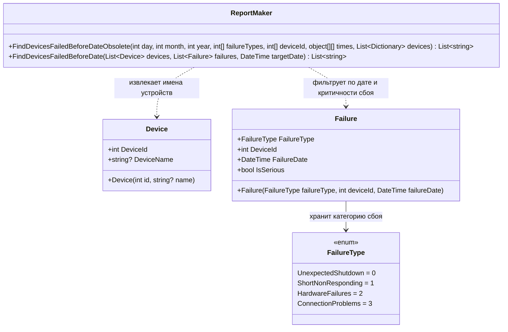

## Практика 1: Сбои

### 1. Описание предметной области:
- *Устройство (Device):* Каждое устройство задается уникальным числовым номером (DeviceId) и имеет наименование (DeviceName).
- *Сбой (Failure):* Каждый сбой содержит ссылку на пострадавшее устройство (DeviceId), точную дату инцидента (FailureDate), а также категорию сбоя (FailureType).
- *Категория сбоя (FailureType):* Строго фиксированный перечень типов неполадок, определяющий характер проблемы.
- *Генератор отчетов (ReportMaker):* Фильтрует весь массив зарегистрированных сбоев, отбирает среди них только серьезные критические инциденты, произошедшие ранее указанной целевой даты, и формирует финальный список имен проблемных устройств.

### 2. Диаграмма классов:

