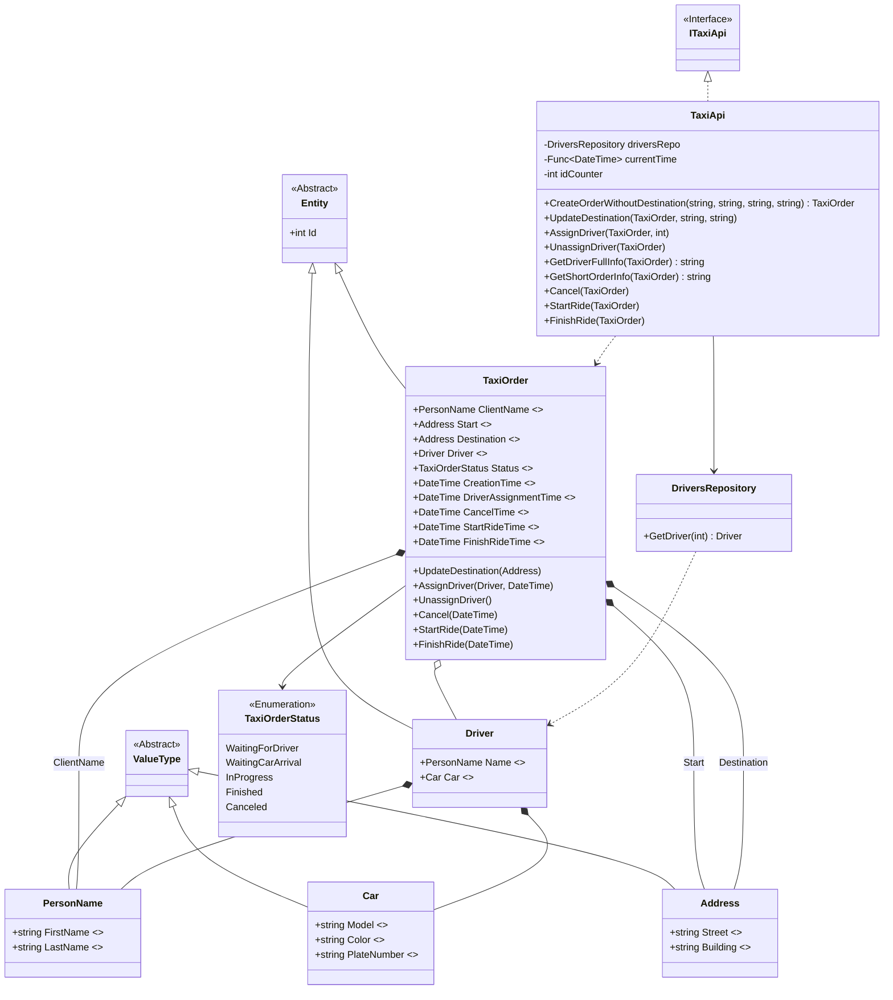

# Практика: TaxiOrder

## 1. Описание предметной области и сущностей
Ключевой сущностью и корнем агрегата выступает TaxiOrder, отвечающий за жизненный цикл поездки и инкапсулирующий всю бизнес-логику валидных переходов между статусами.
Для хранения структурированных данных заказ использует неизменяемые объекты-значения: PersonName (имена участников),
Address (точки маршрута) и Car (характеристики автомобиля), которые не имеют собственной идентичности и существуют только в контексте своих владельцев.
Взаимодействие с внешним контекстом происходит через независимую сущность Driver,
получаемую из DriversRepository, а TaxiApi выступает в роли прикладного сервиса, который лишь делегирует команды объекту TaxiOrder, не нарушая его инкапсуляцию.

## 2. Диаграмма классов (Mermaid)

